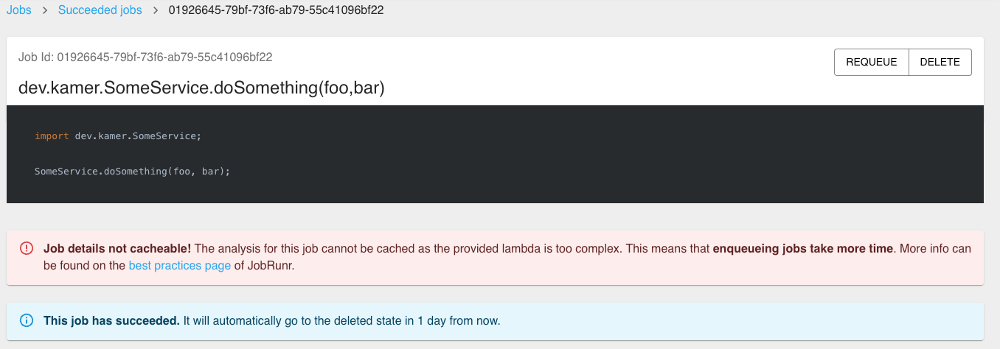

This is reproducer for the discussion here:

https://github.com/jobrunr/jobrunr/discussions/1123

## Running
Run `./gradlew run` and go to http://localhost:8000/dashboard. You'll see the job is not cacheable.

